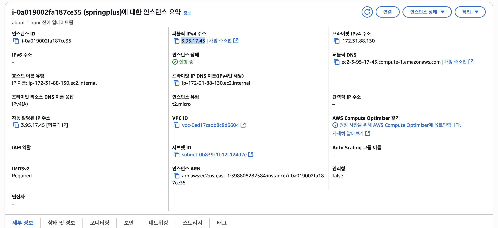
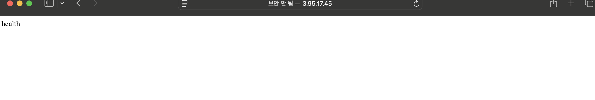

# SPRING PLUS

## EC2



## HealthCheck

- path : /health
  

## 조회 성능 비교 (Index)

| 구분        | 총 수행 시간 (초) | 최대 조회 시간 (초) | 최소 조회 시간 (초) | 평균 조회 시간 (초) | 첫 조회 시간 (초) |
| --------- | ----------- | ------------ | ------------ | ------------ |-------------|
| ❌ 인덱스 미적용 | `2.353`     | `1.329`      | `0.047`      | 약 `0.26`     | 약 `1.45`    |
| ✅ 인덱스 적용  | `1.317`     | `1.171`      | `0.003`      | 약 `0.13`     | 약 `1.17`    |

- 1,2차 캐싱이 테스트코드에서 없어지지 않아서 2번째 조회 이후부터 시간이 줄었습니다.

## 운영 환경 변수

```json
DB_URL=jdbc:mysql: //localhost:3306/yourdb
DB_USERNAME=yourusername
DB_PASSWORD=youruserpassword
SECRET_KEY=your_jwt_secret_key
```